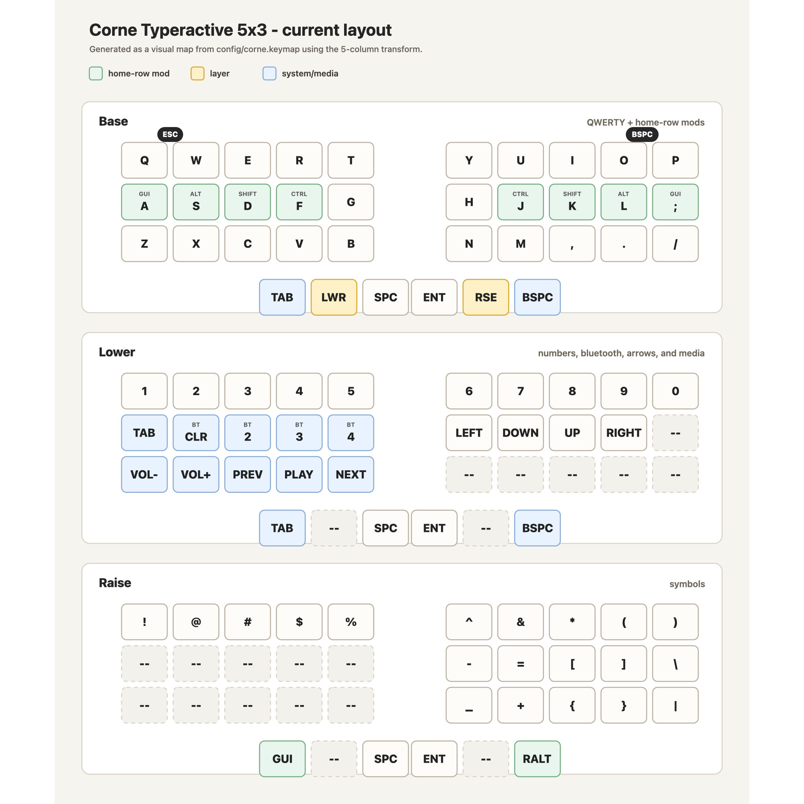

# Corne Typeractive 5x3 ZMK Config

## Quick Read

This is a minimal Corne setup: the base layer is mostly dedicated to letters, the thumbs hold `lower` and `raise`, and the main modifiers live on the home row.

The keymap uses `five_column_transform`, so each layer has exactly 36 positions: 3 rows of 10 keys plus 6 thumb keys. This avoids carrying the virtual outer columns from a 6-column Corne layout.

Things still worth adding for daily work:

- Complete the navigation layer with `HOME`, `END`, `PG_UP`, `PG_DN`, `DEL`, and maybe `INS`.
- Add `F1` through `F12`, especially for IDEs, terminals, browser devtools, and debugging.
- Add quotes, backtick, and tilde to `raise`; there is still enough transparent space for those symbols.
- Complete the Bluetooth profile keys with `BT_SEL 0` and `BT_SEL 1`, in addition to profiles 2, 3, and 4.

## Automation

A common ZMK option is to use `keymap-drawer` to turn `config/corne.keymap` into an image automatically and publish it in the README. The image above is a first visual map of the current layout; the natural next step is to automate its generation.
